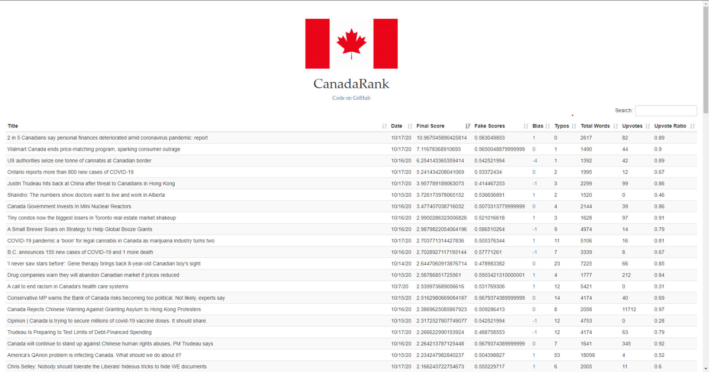

# CanadaRank

### Second Place NewsQ Challenge HackGT 7

CanadaRank is a breaking news ranking model through objective methodology. 

# Table of Contents
- [CanadaRank](#canadarank)
- [Table of Contents](#table-of-contents)
- [Introduction](#introduction)
- [Purpose](#purpose)
- [Brainstorming](#brainstorming)
- [Methodology](#methodology)
- [Steps](#steps)
- [Parameters](#parameters)
- [Algorithm Design](#algorithm-design)
- [Bringing it Together with Front End](#bringing-it-together-with-front-end)
- [Society and Democracy](#society-and-democracy)
- [Areas for Improvement](#areas-for-improvement)
    - [Acknowledgements](#acknowledgements)

# Introduction
After our initial look at the challenge description and the accompanying video, we were interested by the polarization of politics due, in large part, to news. We also feel that computer science and politics have never been so intertwined. To explore our curiosities, we decided to pursue this open-ended challenge. Our goal was to explore a much more objective way to rank what news user(s) residing in a non-US country should see in order. The benefits from an objective ranking system would be reduced polarity and manipulation of users through news. Further, it can help reduce biases that voters hold which could help them make more informed decisions about their representatives.

We wanted to answer the question: "So given the needs of democracies and of machines at scale, what should the rules and considerations be to choosing news articles from numerous articles being generated constantly to provide the most **informative** articles to a user.

Having chosen the backend portion of this challenge(although we made a frontend to go along with our backend), we understood we would need to generate a list of ranks, a design document to explain our processes, and a working product.

# Purpose
We wanted to introduce a bot that can effectively rank news articles about Canada's breaking news sector using Natural Language Processing, along with other methods. With this bot, we would compile a spreadsheet of 100 article sites in ordinal ranking that can demonstrate the effectiveness of the model. We would determine factors such as technical and social to be used for **Canada's breaking news sector** that can be propagated to other countries and sectors and will help inform the user to objectively receive information.

# Brainstorming 
There were a few questions we posed when beginning this challenge:
* What is breaking news?
  * **Breaking news is recently received information about an issue that is currently developing.** 
* What parameters are important to determine what breaking news should be viewed near the top?
  * Time
  * Location
  * Bias
  * Misinformation
    * News that has likely been generated by a machine or is inaccurate
  * Site is mobile friendly
    * We would like our model to favor sites that are mobile friendly
* Where do we retrieve a dataset from?
* Where do we get labels for our dataset such as a ranking of articles?
  * We wanted to apply machine learning after retrieving numerical values for our parameters to determine the ideal weights but this would add heavy bias and is difficult under the time constraints due to unlabeled data. We decided we did not want to hand label data to maintain **objectivity**.
* How do we reduce subjectivity?
* Where do we retrieve news articles from as this will be our "ground truth"?
  * This was a major point of focus as we knew that wherever we retrieve our news articles from (unless we go out with our own notebooks) is ranking the breaking news itself to determine what news to hand to our model. We decided this would be a noted **assumption** as we simply have to assume that whatever API hands us our news articles is objectively picking the breaking news. Obviously, in reality, this is not true so this minimized bias will be present during our hackathon project.
* How do we maximize our efficiency to tackle the most important parameters over the course of the hackathon?

After discussing the questions and purpose mentioned above amongst the group, we decided to brainstorm about our methods to tackling the challenge. We heavily researched NLP models and how news is currently ranked by Bing, Google, etc., to determine the best way to reduce bias and maximize information provided to users.

We immediately knew we would need to retreive news from a non-US country. Then, we needed to pick whether we wanted to explore sports news, breaking news, or political news. Specifically, we wanted to explore the aspect of breaking news as it is quite important due to its urgency. We decided we would go with the Google News API due to its documentation. From there, we would go to the news article and retreive the text, process it for certain parameters to be used in our model, and throw it all in a CSV. Then, we would assign weights to this (perhaps using machine learning). 

# Methodology
We started by designating Canada as our country of focus to prevent a language barrier when retrieving news. Secondly, we chose to focus on breaking news due to its high importance stemming from its urgency. We wanted to be able to provide the most important information in the most objective manner, allowing users to remain informed and as unbiased as possible. We wanted to explore the realm of Google Cloud Engine, Natural Language Processing, Pandas,and Relu functions. 

Next, we made a strong goal of having a finished product by the hackathon deadline.

Then, we created steps to reach this goal.

# Steps
* Scrape a list of breaking news articles from a non US country
* Process each article for certain information(dicussed later)
  * Parameters
* Rank each article with our model
* Output results through a developed frontend

The main question that has yet to be answered is what specific parameters we will focus on and **why**.

# Parameters
* Misinformation
  * It is important to determine if a news source contains disingenuous information that could have been written by either a human or another machine. To combat this, we researched natural language processing techniques that score how likely an article is to contain misinformation or words that were automatically generated. The model we used was based off Harvard NLP Lab's GLTR model, reflecting the current state of the art GPT-2 model from OpenAI. We took into account the final score produced from this machine into our ranking algorithm.
* Credibility of the source
  * Bias - we must evaluate how biased a source is. We would prefer if our breaking news comes from a source who provides the most central viewpoint. This will help to **prevent polarization**, which is one of our focal points to preserve democracy.
* Time of publication
  * Breaking news is from an event that has occurred within the last couple days at most, preferably much more recent.
* Location
  * We would need to weigh this factor in an interesting manner as we want to provide news in a nearby location, but some events are so important that the location does not necessarily matter. We wanted to balance privacy and did not have a great way of retrieving user location data. This would be an important improvement in our news ranking model.
* Impact Factor
  * We want to provide news that has high impact to the user. Ideally, this would be measured in clicks, but we did not have a way to retreive that. Instead, we went with the number of upvotes the article has. We wanted to take this factor into account, but we wanted to keep its **weight low** to keep news as **unbiased** as possible. If we completely relied on crowdsourcing to find important news, our model's bias would increase due to polarized audiences. 
* ~~Site is mobile friendly~~
  * We wanted our model to prefer articles that were mobile friendly as it would reach larger audiences as most people view news through their mobile devices. Through lots of brainstorming, we decided to **avoid** taking this parameter into consideration as it does not determine the quality of the article to inform the reader about an important, urgent issue.
* Typos  
  * With an emphasis on objective ways to determine the quality of a breaking news article, we decided to include a typo ratio (number of typos in a document divided by the number of total words) as it can provide insight about the qualty of the written text.

With our parameters having been determined, we decided to delegate tasks with a focus on objectively determining the quality of a news article. 

The first step was to produce the URLs for breaking news articles in Canada. After researching APIs, we stumbled upon the famous Google News API. After spending a decent amount of time on this, we decided this API would **not fit our needs** to retrieve breaking news as when retrieving breaking news through the API, we were not able to filter it properly. Specifically, when filtering by regular news through the API, it did not let us **specify a country**, and in the breaking news API, it only returned **20 articles**. We wanted to have about 100 articles to able to properly train our NLP model for fake news detection and provide enough data to determine the effectiveness of our model.  

After making this large pivot, we had to look for another location to get country-specific breaking news in a large quantity. After much deliberation, we decided to go with the Reddit API to filter by the subreddit r/Canada and sort by r/new while also making sure the article was published within the appropriate time frame. We immediately understood that this has the implications that r/Canada may not provide the most objective breaking news; however, in order to get the quantity and appropriate articles we would need to utilize Reddit's amazing API. Specifically, we went with PRAW -> Python Reddit API Wrapper. 

Through PRAW, we wrote a script to scrape the top 100 URLs that meet our breaking news criteria: news in a recent timeframe. From there, we wanted our model to go to the URL and retrieve all of the relevant text from the news article. For this, we used the "Newspaper3k : Article scraping and curation" library in order to retrieve key information such as the text, the time of publication, and the source. This text would be later used to train our GLTR model to detect misinformation, a parameter in our model. 

Then, we utilized PRAW to determine the value of our parameter: Impact Factor. PRAW allowed us to retrieve the number of upvotes and therefore calculate the upvote ratio, which provides us a crowdsourced answer for the quality of an article. We wanted to keep the weight of this parameter low as we didn't want people's news feed to be biased by other people's interests. We wanted to reduce the domino effect that occurs in news today, but still wanted to provide news that is important to the members of the country or region. It was important to allow non-crowd favored, quality articles to reach the top of the news feed. 

After having collected the parameters thus far, the team researched **media bias: the perceived bias of the source towards one political side of the spectrum."** In order to calculate the bias of a source, we referenced www.allsides.com/ and scaled each article's source between [-2 , 2]. -2: LEFT, -1: LEFT-CENTER, 0: CENTER, 1: RIGHT-CENTER, 2: RIGHT. Our model would perceive LEFT = RIGHT, LEFT-CENTER =  RIGHT-CENTER to **prevent political bias and therefore maintain objectivity**, a need in today's society. Our model would assign the highest value to sources with a bias rating of 0 (CENTRIST SOURCES) as determined by allsides.com.

We compiled all of our parameters in a CSV, that would be used by the model to then calculate the weights and provide a final score for each news article. We then created a UI to express our final results.  

# Algorithm Design
The process of compiling all this data left us with a strong group of datapoints of which we were able to build our ranking insights. In order to do this, we proceeded with a number of steps, namely:
* Identifying the most important features of our news ranking dataset
* Conceptualizing the ways that these factors interacted
* Normalizing our features in order to arrive at more comparable, scalable metrics
* Creating a regression model to classify our data features

First of all, we began brainstorming the most crucial data points we collected based on the information we had.

# Bringing it Together with Front End
The front end aspect of this project wasn't the central focus, so we brought together our results with a simple interface that can be viewed from the web by users. The news articles are ranked from "best" to "worst" as determined by our algorithm from top to bottom, and the user can optionally sort the articles by a specific parameter of their choosing(as shown in the image below). We think that tackling how ranked news should be presented is an area that can be sought out after by more developers and designers, creating solutions that attract users.

# Society and Democracy
There is no doubt that news ranking is fundamentally important to conserving democracy--if citizens do not have the access to a neutral, non-biased source of news, then it is very possible that their beliefs and actions will be indirectly influenced by the news they see. One approach our algorithm takes to combat this issue is to downplay the popularity of a news article. While often the most popular results are shown first to users, CanadaRank will give little weight to this category, instead, prioritizing parameters we think are more important in determing a good news article.
  
# Areas for Improvement
Although we are very proud of the work that we were able to accomplish, the limitations of the hackathon left us with a couple of areas we wished for improvement. For one thing, we wanted to explore a wider breadth of news sources in order to amalgamate our data, as opposed to strictly confining our searches based on Reddit's provision of news. This would have allowed to make our model more sensitive and protective to different alterations in metadata, and change the overall outcomes we received on our project. Another key area of improvement is in line with this example, and derives from the lack of time we had to fully train our model, and explore all possible organizations and normalization methods for our features. We were forced to make do with a simple regression model, and having an extra buffer would have allowed us to further explore the relationships between variables and their effects on our final score. Ultimately, the "perfect" solution to this problem is an open question, but having these deeper insights would have allowed us to make further progress towards answering this question.

In terms of the other aspects of our project, we wanted to have more time to provide a more robust dashboard and visualization of the data that we generated. Moving beyond just a simple CSV interface, we wanted to show deeper insights with charts and sensitivity plots of our different parameters. Another key aspect that we wanted to add is dynamic updates to our project. While we initially just built it to function locally on a test dataset, we wanted to create a full stack application that allows the user to survey different news sources over time and continuously receive updates on what is best for them.

All in all, these areas would have greatly improved the overall vitality of our project, and give us promising areas for future exploration.

### Acknowledgements
Casheer
